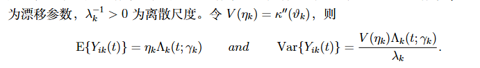
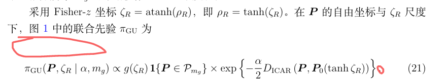
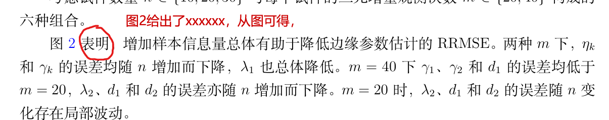
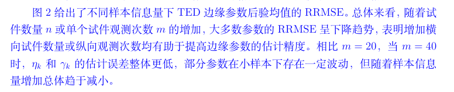
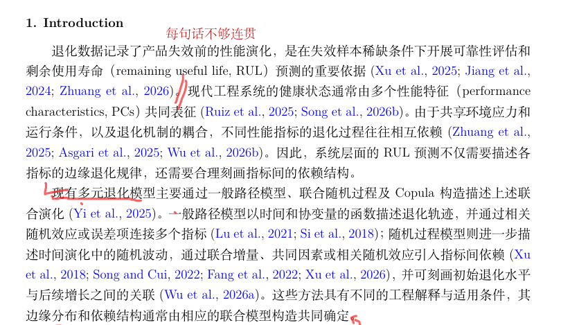
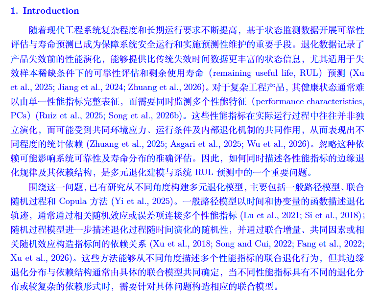

# [科研写作技巧笔记](https://mp.weixin.qq.com/s/ES091s4kDqzbtgZtwmuI3w)


## 简介

由于需要对新师弟师妹进行“培训”，所以趁这个机会，把一些科研写作中容易出现的坑一一整理出来！庄小编打算开个新的系列，打算整理下自己在科研写作方面的笔记。

> **注意**：这个庄小编的**科研写作笔记**，不是教程噢！我只是个科研新手，眼界比较低，说的不一定对，大家觉得对的拿去用，不对的看看就行了（好心人也欢迎来批评）～

该系列主要针对科研新手，使用 LaTeX 写英语科研论文。但是一些经验也不限于此。

> 如果你对 LaTeX 写作不了解并感兴趣的话，可参考这些教程： 。 

初步打算讲：1.格式问题；2. 英语问题（自己薄弱环节）；3. 写作逻辑问题；

第一部分来讲讲 LaTeX 中的**写作格式**可能出现的问题。

## 写作格式问题：

### 1. **符号问题**：

与中文不同，英语标点符号后面需要空格（, . : ）


### 2. **缩写问题**：

第一次出现需要全称 + 缩写（例如：accelerated life test (ALT)），之后都用缩写表示（例如：ALT is xxx）。

### 3. **公式问题**：

a. 末尾需要加入标点符号。

> **注意**：句号后面新的句子需要大写，逗号后面需要小写。
  


      


        
b. 并列的公式需要对齐，使用 ``\begin{aligned} \end{aligned}``。
    


    
c. 所有符号第一次出现都需要标明含义，或者有专门一节罗列并说明全文符号。


    
d. 公式中的括号需要使用 ``\left( \right)``，不要直接使用`()`。其他括号``{},[]``类似操作。


    
e. 公式中的文字需要使用 ``\text{}``，例如：`x \quad \text{and} \quad y`，并前后可以适当添加空格`\quad`。

**两个公式在同一行并列时，可以用 and 连接。**

如果两个公式表达的是“并且”的关系，可以在中间加入 `and`，并在两侧留出适当间距。例如，同时给出均值和方差时，可以写成：

```latex
\[
\mathrm{E}\{Y_{ik}(t)\} = \eta_k \Lambda_k(t;\gamma_k)
\quad \text{and} \quad
\operatorname{Var}\{Y_{ik}(t)\}
= \frac{V(\eta_k)\Lambda_k(t;\gamma_k)}{\lambda_k}.
\]
```

这里使用 `\text{and}` 输入连接词，使用 `\quad` 添加间距；导言区需要加载 `amsmath` 宏包。

修改前：


修改后：



> **注意**：数学环境中，直接敲普通空格通常不会产生想要的间距噢！可以使用 `\quad`，需要更宽一些时使用 `\qquad`。是否添加 `and` 要看上下文的语法关系，并不是所有并排公式都必须添加；公式末尾的标点也要与所在句子保持一致。

    
f. 注意全文符号不要用重，太多符号的话，可以  ``\mathbb{}, \mathcal{}`` 等区分。
    
g. 推荐一个公式截图软件 [Mathpix Snipping Tool](https://mathpix.com/)，建议使用学校邮箱，每个月会有 100 次免费使用次数。小编以前写过相关介绍[推文](https://mp.weixin.qq.com/s/ScOf0CPD9fO_II92Q4CHlA)。
    
**h. 正文与紧接的公式之间，不要随意留空行。**

正文引出公式时，如果它们属于同一句话或同一段，LaTeX 源码中就不要在两者之间留空行。空行会被理解为**另起一段**，可能造成公式前的间距偏大，让本来连贯的内容显得断开。[关于空行与分段的说明](https://www.overleaf.com/learn/latex/Paragraphs_and_new_lines)

正文与公式间距偏大的示例：



例如，不推荐这样写：

```latex
The sample mean is given by

\begin{equation}
    \bar{x} = \frac{1}{n}\sum_{i=1}^{n} x_i,
\end{equation}
where $n$ is the sample size.
```

可以改成：

```latex
The sample mean is given by
\begin{equation}
    \bar{x} = \frac{1}{n}\sum_{i=1}^{n} x_i,
\end{equation}
where $n$ is the sample size.
```

公式后面如果紧接着用 `where` 解释符号，并且仍然属于同一段，也不要在 `\end{equation}` 与正文之间留空行。

> **注意**：源码中的“换行”和“空一行”是不一样的噢！为了方便阅读，可以把公式环境写在下一行，但中间不必留一个空白行。真正开始新段落时，仍然可以正常空行。编译后的具体间距还受模板和公式间距设置影响，并不一定恰好多出一整行。[公式间距说明](https://www.overleaf.com/learn/latex/%5Cabovedisplayskip_and_related_commands)

### 4. **参考文献问题：**

a. **搜索方式**：使用[谷粉学术](https://gfsoso.99lb.net/)搜索文章，点击引用，下载 BibTeX 格式，加入到 .bib 文件中。


b. 参考文献需要一致。

c. **注意细节**：

1). 论文名称特定大写，且不在首个字母，需要使用{}标注，例如 A {B}ayesian reliability。


2). & 符号前需要添加 \，例如：Reliability Engineering \& System Safety


3). 不同期刊要求不同：有的需要添加月份；有的需要添加 doi。


4). 尽可能阅读和引用高质量文章（业内认可度高的期刊，不同方向分类讨论）

> 例如可靠性领域中：IEEE 系列(TR，TIE，TII等)、Technometics、JQT、RESS、IISE、EJOR、QTQM 等。
    
d. 近几年的文献需要追踪和引用，投稿期刊的文章需要引用多篇（3-4）近 2 年文献（个人观点，和 IF 有关）。
    
### 5. **图表问题**

a. 图表标题后需要添加符号。每个图表需要添加标签`\label{}`，索引时使用 ``\ref{}``。


b. 图表大小合适，使用`\scalebox{0.83}{}`缩放表格；使用 ``[width=16cm]`` 修改图片大小。例如：``\includegraphics[width=16cm]{figure/xx.pdf}``。


c. 最好将图片放到新的文件夹中（例如：figure，然后使用上述（`figure/xx.pdf`）加载图片）。

d. 图表最好放在文中的 top/bottom 位置，可以通过[tb]来修改，例如：``\begin{figure}[tb]  \end{figure}``。


e. 小数点后保留位数同类型数据需要保持一致。不同表也应该相对一致。


表格加载示例代码：
```latex
\begin{table}[htbp]
	\centering
	\caption{The progressive censoring schemes for $k=3$.}
	\vskip 0mm \setlength{\tabcolsep}{4mm}
	\scalebox{0.93}{
	    \begin{tabular}{cllll}
	    \end{tabular}}
	\label{tab1}
\end{table}%
```

图片加载示例代码：
```latex
\begin{figure}[htbp]
	\centering
	\includegraphics[width=0.95\columnwidth]{figure/xxx.pdf}\\
	\caption{xxx.}
	\label{xxx}
\end{figure}
```
> 加载 2*2 的图片等排版情况可见： 。 

**f. 描述图表时，先交代展示的内容，再介绍从中得到的结果。**

有时候，我们写完“图 2 表明……”就直接开始分析结果，却忘了先告诉读者：这张图展示的是什么？比较了哪些情况？小编建议，可以按下面的顺序来写：

> **图表给出了什么 → 主要趋势或差异是什么 → 这些结果说明了什么。**

修改前：



修改后：



1). **先介绍图表的内容，让读者知道该看什么。**

例如，先说明图中展示的是哪些参数、什么评价指标，以及在哪些条件下进行比较：

> 图 2 给出了不同试件数量 $n$ 和单个试件观测次数 $m$ 下，TED 边缘参数后验均值的 RRMSE。

这样，读者就知道，接下来需要关注的是不同样本设置下参数估计误差的变化。

2). **先概括主要规律，再补充有代表性的细节。**

描述图表时，可以先说整体趋势，再介绍重要的组间差异或例外情况。不必把图中每个参数、每条曲线的变化逐一复述一遍，否则容易写成“看图报数”，主要结论反而不突出了。

例如，上图中的修改版先概括“大多数参数的 RRMSE 呈下降趋势”，再补充不同 $m$ 下的比较和小样本时的局部波动，读起来就更容易抓住重点。

> **注意**：哪些细节值得写，要看它们是否影响结论。与整体趋势不一致的重要结果，也需要交代清楚，不能只挑符合预期的部分来讲。

3). **在描述结果之后，说明它与研究问题的关系。**

例如，“RRMSE 总体下降”是图中观察到的变化；“增加试件数量或单个试件的观测次数，有助于提高估计精度”则进一步说明了这一变化的含义。


## 写作逻辑问题

### 1. **引言问题：从背景逐步引出问题，注意前后衔接**

不少科研新手写引言（Introduction）时，会把自己知道的概念、研究背景和参考文献一股脑放上去。每句话单独看好像都没问题，但连起来读，就容易让人觉得：怎么突然讲到这里了？

小编觉得，写引言时可以多想一步：**读者为什么需要先了解这句话？读完之后，能不能自然地理解下一句话？**

修改前：



修改后：



a. **开头先交代背景，让读者知道这项研究为什么值得做。**

以可靠性方向的论文为例，可以从现代工程系统的运行需求、复杂装备的安全保障、预测性维护等背景切入，再逐步引出可靠性评估与寿命预测。

例如，修改前直接以“退化数据记录了产品失效前的性能演化”开头，较快地进入了研究对象。修改后则先补充：

> 随着现代工程系统复杂程度和长期运行要求不断提高，基于状态监测数据开展可靠性评估与寿命预测已成为保障系统安全运行和实施预测性维护的重要手段。

这样，读者先了解工程中的需求，再去理解为什么要研究退化数据，后面的内容就更容易接上。

> **注意**：背景要与自己的研究相关，篇幅也要适当。系统工程、工业 4.0、制造强国建设，以及与研究相关的“十五五”规划内容，都可以作为候选切入点，但需要具体说明它们与本文问题的联系，涉及政策时也要引用准确的来源。第一句话并不一定要从宏观政策写起，直接从具体工程需求切入也可以噢！

b. **句子之间要有递进关系，把中间的道理讲清楚。**

在这个例子中，原版已经提到了退化数据、多性能指标和指标间的依赖，但有些地方展开得比较快。修改版进一步补充了两个重要环节：

- **为什么要考虑多个指标？** 因为单一性能指标往往难以完整表征复杂产品的健康状态。
- **为什么要关注指标间的依赖？** 因为这些指标可能受到共同环境和运行条件的影响，忽略这种依赖可能影响可靠性及寿命分布的评估。

这样，段落的思路就可以顺着读下来：

> 工程中的可靠性与寿命预测需求 → 退化数据的作用 → 单一指标的不足 → 多个指标之间的依赖 → 忽略依赖可能带来的影响。

新手写作时，可以试着检查：前一句提出的内容，后一句有没有继续解释、细化或者推进？如果只是换了一个相关概念，读者可能还需要自己去补中间的逻辑。

> **注意**：加入“此外”“然而”“因此”，并不代表句子之间就有逻辑了。尤其是“因此”后面的结论，要能从前面的内容中推出来。

c. **背景之后点出具体问题，再过渡到文献综述。**

介绍完背景，可以先收束到本文关注的问题。例如，修改版在第一段末尾写道：

> 因此，如何同时描述各性能指标的边缘退化规律及其依赖结构，是多元退化建模与系统 RUL 预测中的一个重要问题。

这句话把前面讲到的内容集中起来，也给下一段的文献综述确定了范围。随后再接：

> 围绕这一问题，已有研究从不同角度构建多元退化模型……

读者就容易理解：接下来介绍这些文献，是为了说明已有研究如何处理刚才提出的问题。


> **注意**：提出一个值得研究的问题，还不等于证明现有研究存在不足。已有方法解决到了什么程度、还有哪些限制，需要结合后面的文献综述来说明。

d. **文献综述也要继续推进问题，说明已有方法做到了什么、还受到哪些限制。**

介绍已有研究时，可以按研究思路或方法类别组织。例如，图中的例子先介绍一般路径模型、联合随机过程及 Copula 方法，再说明各类方法如何描述多个指标及其依赖关系。


写到这里，可以依次考虑：

> 已有研究采用了哪些思路？这些思路解决了什么？在本文关注的情形下，还有什么需要进一步处理？

后续再介绍自己的方法和贡献，就有了前面的铺垫。


## 小编有话说

这些是目前小编能想到的一些小细节。如果读者有什么补充可文末留言，或者来我的 Github 提出 issue。 希望这个系列能够一直完善下去，为更多的科研新手造福。欢迎投稿，留言分享～


